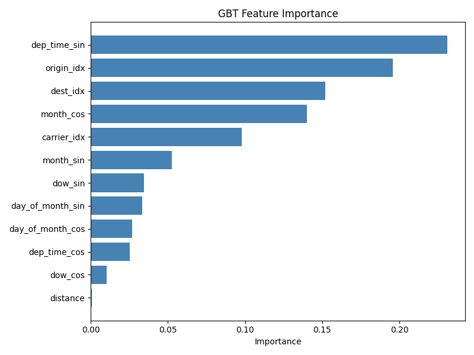

# Flight Departure Delay Prediction with PySpark

Predicting whether a US domestic flight will depart 15 or more minutes late, using PySpark MLlib on 7,079,081 flights from 2024.

- Course: DSAI4202, University of Doha for Science and Technology (UDST)
- Authors: Maryam Mahaboob and Amina Baziz

## Results at a glance

- **Data:** 7,079,081 flights in the raw 2024 data, 1,673,114 modelled after cleaning and sampling.
- **Best model:** Gradient Boosted Trees, with AUC-ROC 0.6975 and AUC-PR 0.3724 (baseline about 0.21, the share of delayed flights).
- **Threshold tuning:** at threshold 0.20, GBT catches 66.3% of delays, compared with 6.5% at the default 0.50.
- **Top drivers:** departure time, origin and destination airport, month, and carrier.

## Why this matters for airlines

- **On-time performance (OTP):** a main airline KPI. The US DOT counts a flight as late at 15 or more minutes, the same cutoff used here.
- **Operations control:** a pre-departure delay risk score gives time to position spare aircraft, call reserve crew, or protect tight turnarounds.
- **Hub connections:** at hubs, one late departure can break connections for transfer passengers, so flagging at-risk departures helps with rebooking and gate planning.

## Results

| Model | Weighted F1 | AUC-ROC | AUC-PR |
|---|---|---|---|
| Logistic Regression | 0.6215 | 0.6519 | 0.3058 |
| Random Forest | 0.6440 | 0.6674 | 0.3368 |
| GBT | 0.7270 | 0.6975 | 0.3724 |

Lowering the GBT threshold to 0.20 catches 66.3% of delays instead of 6.5%; see [docs/analysis.md](docs/analysis.md).

## Key insights

- **Departure time is the top feature** (GBT importance about 0.23). Delays build up over the day as earlier late arrivals push back later departures.
- **July and Friday peaks:** July has the highest average delay (about 22 minutes) and Friday the highest by day of week (about 14 to 15 minutes).
- **Carriers differ:** F9 (Frontier) has the highest delay rate at about 28%. HA (Hawaiian) and YX have the lowest.
- **Hub airports:** among the 10 busiest airports, DFW (about 27%) and CLT (about 26%) have the highest delay rates.
- **Distance barely matters:** near-zero GBT importance and a 0.02 correlation with the label.

## Limitations

- The cancelled filter (31% of rows) and null drop (about half the sample) removed more data than expected and need checking.
- The threshold was picked on the test set, so tuned metrics are somewhat optimistic.
- GBT was trained without class weights; only LR and RF used `weightCol`.
- No weather or air traffic control data in the features.

Full details: [docs/analysis.md](docs/analysis.md)

## How to run

1. Download `flight_data_2024.csv` from [Kaggle](https://www.kaggle.com/datasets/hrishitpatil/flight-data-2024) (see [data/README.md](data/README.md)).
2. Upload it to Google Drive at `MyDrive/DSAI4202_Project/flight_data_2024.csv`, or change the path in the data loading cell.
3. Open the notebook in Google Colab and run the cells from top to bottom.

Requirements: see [requirements.txt](requirements.txt).
