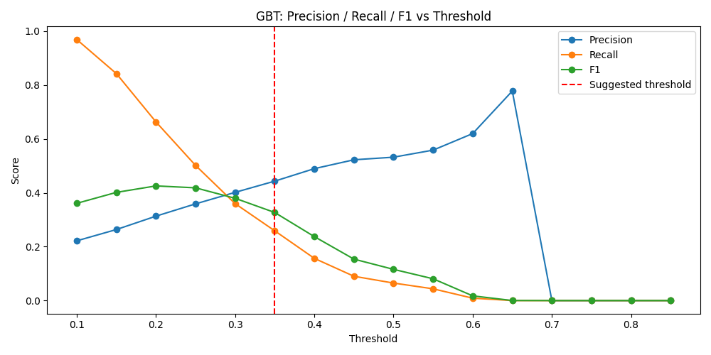
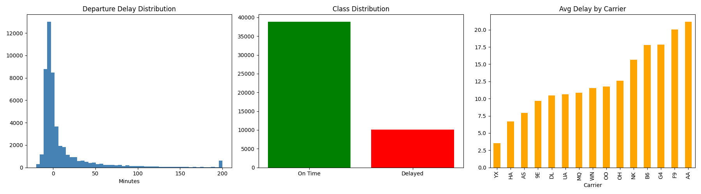
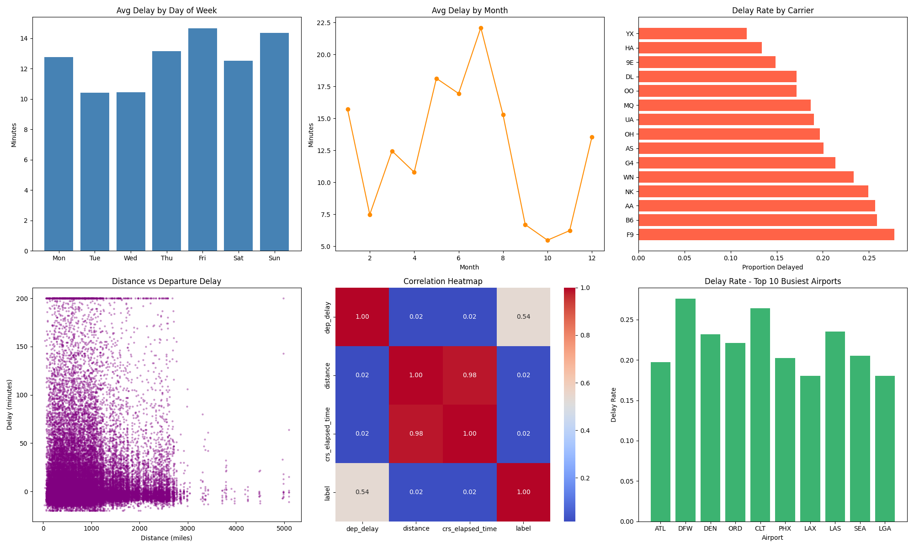

# Detailed Analysis

Supporting detail for the [project README](../README.md). All numbers come from the saved outputs of [the notebook](../notebooks/flight_delay_prediction_pyspark.ipynb).

## Approach

- **Pre-departure features only:** schedule, carrier, airports and distance. `dep_delay` is used only to build the label.
- **Cyclical encoding:** month, day of week, day of month and departure time as sine/cosine pairs.
- **StringIndexer + Pipelines:** carrier and airports indexed inside MLlib Pipelines fitted on training data only.
- **Class weights:** 20.6% of flights are delayed (3.86 : 1), so LR and RF use a weight of 3.86 on delayed flights.
- **CrossValidator + threshold tuning:** 3-fold CV over GBT depth and iterations, then the decision threshold is tuned without retraining.

## Main results

Test set of 334,277 flights. F1 is weighted across both classes.

| Model | Accuracy | Weighted F1 | AUC-ROC | AUC-PR |
|---|---|---|---|---|
| Logistic Regression | 0.5814 | 0.6215 | 0.6519 | 0.3058 |
| Random Forest | 0.6062 | 0.6440 | 0.6674 | 0.3368 |
| GBT (untuned) | 0.7963 | 0.7270 | 0.6975 | 0.3724 |
| GBT (tuned, CV) | 0.7963 | 0.7270 | 0.6975 | 0.3724 |

GBT threshold tuning (delayed class). The full table, including thresholds 0.55 to 0.85, is in [Threshold tuning](#threshold-tuning) below.

| Threshold | Accuracy | Precision | Recall | F1 (delayed) |
|---|---|---|---|---|
| 0.10 | 0.2957 | 0.2218 | 0.9689 | 0.3610 |
| 0.15 | 0.4846 | 0.2637 | 0.8424 | 0.4016 |
| **0.20** | **0.6325** | **0.3134** | **0.6631** | **0.4256** |
| 0.25 | 0.7138 | 0.3590 | 0.5016 | 0.4185 |
| 0.30 | 0.7585 | 0.4017 | 0.3598 | 0.3796 |
| 0.35 | 0.7811 | 0.4434 | 0.2589 | 0.3269 |
| 0.40 | 0.7933 | 0.4897 | 0.1567 | 0.2374 |
| 0.45 | 0.7963 | 0.5226 | 0.0902 | 0.1539 |
| 0.50 | 0.7963 | 0.5323 | 0.0650 | 0.1159 |



The red line in the plot marks 0.35, which the plot code labels "Suggested threshold". The threshold chosen in the analysis is 0.20, where delayed-class F1 is highest.

## Repository structure

```
├── README.md
├── requirements.txt
├── data/README.md          # dataset source and columns used (raw data not included)
├── docs/analysis.md        # detailed tables, limitations, next steps, EDA figures
├── figures/                # plots saved from the notebook
└── notebooks/flight_delay_prediction_pyspark.ipynb
```

## Requirements and run notes

`pip install -r requirements.txt` (pyspark, pandas, numpy, matplotlib, seaborn). Outside Colab you also need Java 17 or later, and you need to replace the Google Drive path.

The saved outputs come from a run on Spark 4.0.2. Cells were not run strictly in order, so a fresh run may differ slightly.

## Data and preprocessing

Source: [Flight Data 2024 on Kaggle](https://www.kaggle.com/datasets/hrishitpatil/flight-data-2024) (7,079,081 rows x 35 columns). The raw data is not included here. See [data/README.md](../data/README.md) for download and placement.

| Step | Rows |
|---|---|
| Raw file | 7,079,081 |
| Keep 11 columns, remove cancelled flights (`cancelled == 0`) | 4,875,668 |
| 70% random sample (seed 42), drop rows with nulls in `dep_delay`, `distance`, `crs_elapsed_time` | 1,673,114 |
| Train split (80%, seed 42) | 1,338,837 |
| Test split (20%) | 334,277 |

- Label: 1 if `dep_delay` >= 15 minutes, otherwise 0.
- Only features known before departure are used. `dep_delay` is used only to build the label.
- `crs_elapsed_time` was dropped as a feature because it has a 0.98 correlation with `distance`.

## Feature engineering

- **Cyclical encoding.** Month, day of week, day of month and scheduled departure time are circular (December is next to January, 23:59 is next to 00:00). Each one is turned into a sine and a cosine column, giving 8 columns.
- **Categorical columns.** Carrier, origin airport and destination airport are converted to numeric indices with `StringIndexer` (`handleInvalid="keep"` so unseen airports in the test set do not cause errors).
- **Final feature set.** 12 features: `carrier_idx`, `origin_idx`, `dest_idx`, `distance`, `month_sin`, `month_cos`, `dow_sin`, `dow_cos`, `day_of_month_sin`, `day_of_month_cos`, `dep_time_sin`, `dep_time_cos`.
- **Pipelines.** The indexers, `VectorAssembler` and model are wrapped in MLlib `Pipeline`s, so the indexers are fitted on the training data only.

## Class imbalance

- Delayed: 344,294 flights (20.6%). On time: 1,328,820 flights (79.4%). Ratio 3.86 : 1.
- A model that always predicts "on time" would get about 79% accuracy, so accuracy alone is not a useful metric here.
- Logistic Regression and Random Forest were trained with a weight of 3.86 on delayed flights (`weightCol`).
- GBT was trained without class weights. Spark 3.0+ supports `weightCol` for GBT, so adding weights is a planned improvement.

## Models

Four models were compared on the test set (334,277 flights):

- Logistic Regression (`maxIter=10`, weighted)
- Random Forest (20 trees, `maxDepth=5`, weighted)
- Gradient Boosted Trees (`maxIter=20`, `maxDepth=5`, no weights)
- GBT tuned with 3-fold `CrossValidator` over `maxDepth` in {3, 5} and `maxIter` in {10, 20}

How to read the main results table in the README:

- **F1 is weighted across both classes**, so it is pulled up by the large on-time class. The delayed-class numbers below are more informative.
- **AUC-PR baseline is about 0.21**, the share of delayed flights. A random model would score about 0.21, so GBT's 0.3724 is a real improvement, but a modest one.
- **Tuned and untuned GBT are identical.** Cross-validation picked `maxDepth=5`, `maxIter=20` (CV AUC 0.6980), which were already the untuned settings. CV AUC ranged from 0.6792 to 0.6980 across the 4 settings.

Delayed-class (class 1) metrics at the default 0.5 threshold:

| Model | Precision | Recall | F1 |
|---|---|---|---|
| Logistic Regression | 0.2805 | 0.6640 | 0.3944 |
| Random Forest | 0.2932 | 0.6503 | 0.4041 |
| GBT | 0.5323 | 0.0650 | 0.1159 |

The weighted models flag many flights and catch about two thirds of delays, but with many false alarms. The unweighted GBT at 0.5 almost never predicts a delay and catches only 6.5% of them.

## Threshold tuning

GBT ranks flights best (highest AUC-ROC and AUC-PR), but the default 0.5 threshold is too high for a 20.6% positive class. The threshold on GBT's predicted probability was varied without retraining:

| Threshold | Accuracy | Precision | Recall | F1 (delayed) |
|---|---|---|---|---|
| 0.10 | 0.2957 | 0.2218 | 0.9689 | 0.3610 |
| 0.15 | 0.4846 | 0.2637 | 0.8424 | 0.4016 |
| **0.20** | **0.6325** | **0.3134** | **0.6631** | **0.4256** |
| 0.25 | 0.7138 | 0.3590 | 0.5016 | 0.4185 |
| 0.30 | 0.7585 | 0.4017 | 0.3598 | 0.3796 |
| 0.35 | 0.7811 | 0.4434 | 0.2589 | 0.3269 |
| 0.40 | 0.7933 | 0.4897 | 0.1567 | 0.2374 |
| 0.45 | 0.7963 | 0.5226 | 0.0902 | 0.1539 |
| 0.50 | 0.7963 | 0.5323 | 0.0650 | 0.1159 |
| 0.55 | 0.7965 | 0.5585 | 0.0436 | 0.0809 |
| 0.60 | 0.7954 | 0.6199 | 0.0089 | 0.0175 |
| 0.65 | 0.7947 | 0.7778 | 0.0001 | 0.0002 |
| 0.70 to 0.85 | 0.7947 | 0.0000 | 0.0000 | 0.0000 |

The best delayed-class F1 is **0.4256 at threshold 0.20**, with recall 0.663 and precision 0.313. At the default 0.50, recall is only 0.065. Lowering the threshold raises recall about tenfold without retraining.

Confusion matrix at threshold 0.20 (test set):

| | Predicted on time | Predicted delayed |
|---|---|---|
| Actually on time | 165,930 | 99,708 |
| Actually delayed | 23,127 | 45,512 |

In operational terms, 45,512 real delays get an early flag and 23,127 are missed. The cost is 99,708 false alarms. Whether that trade-off is acceptable depends on what a flag triggers. A cheap action like an internal ops alert can tolerate a low threshold. A passenger-facing notification needs a higher one.

## Overfitting check

| Model | Train AUC | Test AUC | Gap |
|---|---|---|---|
| Logistic Regression | 0.6531 | 0.6519 | 0.0013 |
| Random Forest | 0.6695 | 0.6674 | 0.0020 |
| GBT (untuned) | 0.7056 | 0.6975 | 0.0081 |
| GBT (tuned) | 0.7056 | 0.6975 | 0.0081 |

All train vs test AUC gaps are under 0.01, so none of the models is overfitting. The limit on performance comes from the features available, not from model variance.

## Known limitations

- **Cancelled-flight filter.** Filtering to `cancelled == 0` removed 31% of rows (7,079,081 to 4,875,668). That is far above typical cancellation rates. It may also be dropping rows where `cancelled` is null. This needs to be checked.
- **Null drop.** Sampling 70% of 4,875,668 rows and then dropping nulls left 1,673,114 rows, so the null drop removed about half of the sample. The removed rows may not be random.
- **Threshold chosen on the test set.** The 0.20 threshold was picked using test data, so the threshold-tuned metrics are somewhat optimistic. A separate validation set should be used.
- **GBT trained without class weights.** Only LR and RF used `weightCol`.
- **Airports are index-encoded.** `StringIndexer` indices work for tree models, but Logistic Regression treats them as ordered numbers, which is not ideal. One-hot encoding would suit LR better.
- **ChiSqSelector is not suitable for these features.** ChiSqSelector expects non-negative categorical features, so its ranking of the sine/cosine and continuous features is not reliable. It selected the first 8 features in column order. Retraining GBT on those 8 features lowered AUC from 0.6975 to 0.6411, so all 12 features were kept.
- **No weather or air traffic data.** Weather, air traffic control restrictions and the delay of the incoming aircraft are major causes of departure delays, and none of them are in the feature set.

## Next steps

- Add weather data for origin and destination airports.
- Add airport congestion features, such as scheduled departures per hour and historical delay rates by airport and hour.
- Train GBT with class weights (`weightCol`).
- Choose the decision threshold on a validation split, then report final metrics on an untouched test set.
- Check the cancelled filter and the null drop to recover rows that should not have been removed.

## EDA figures

**EDA overview:** departure delay distribution (clipped to -20 to 200 minutes), class distribution and average delay by carrier (1% sample).



**EDA extended:** average delay by day of week and by month, delay rate by carrier, distance vs delay, correlation heatmap, and delay rate at the 10 busiest airports.


